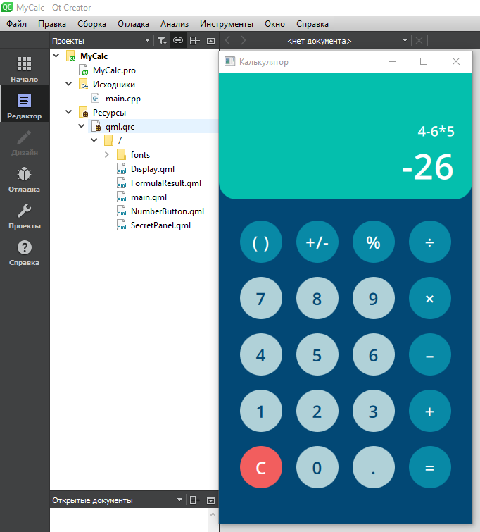

# Тестовое задание: Калькулятор со скрытым меню

## Задание выполнено ✅

### 📱 Описание реализации
Разработан калькулятор для Android на Qt/QML, полностью соответствующий предоставленному прототипу Figma.

### ✅ Реализованные требования

#### 1. **Интерфейс по прототипу**
- Точное соответствие макету: [Calculator_Android](https://www.figma.com/file/gJIvIUNBfA1OqMXshPFocu/Calculator_Android?node-id=0%3A1)
- Все визуальные элементы расположены согласно дизайну
- Сохранены пропорции, цвета, шрифты и отступы

#### 2. **Базовые математические операции**
- Сложение (+)
- Вычитание (-)
- Умножение (×)
- Деление (÷)
- Процент (%)
- Смена знака (±)
- Очистка (AC/C)
- Десятичная точка (.)

#### 3. **Работа с большими числами**
- Поддержка чисел до **25 знаков** (включая десятичную часть)
- Автоматическое округление при превышении лимита
- Отображение "Ошибка" при переполнении

#### 4. **Секретное меню**
- **Активация:** Долгое нажатие (4 секунды) на кнопку "="
- **Ввод кода:** В течение 5 секунд после удержания ввести комбинацию "123"
- **Результат:** Открытие второго экрана с надписью "Секретное меню" и кнопкой "Назад"

### 🛠 Технологический стек
- **Среда разработки:** Qt 5.14+
- **Графический интерфейс:** QML (Qt Quick)
- **Логика:** C++/Qt
- **Целевая платформа:** Android

## Скриншот

