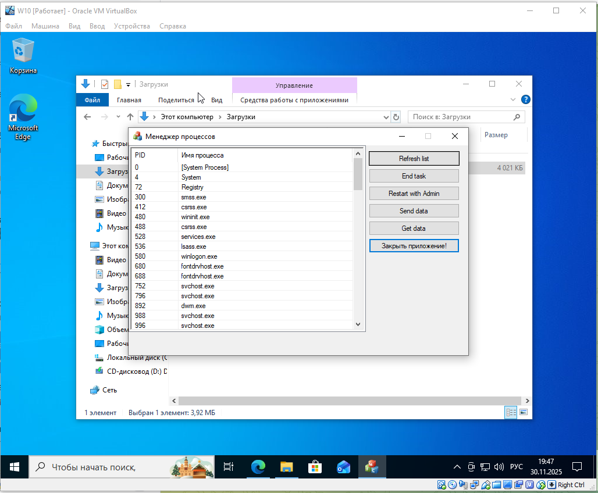

# Process Manager - Аналог Диспетчера задач Windows

## Обзор
Приложение на C++/WinAPI для мониторинга и управления процессами Windows с возможностью обмена данными с сервером. Разработано в рамках тестового задания на должность Старшего программиста в ООО «Нетнуклеус Софт».

## Функциональность

### Основные функции
- **Мониторинг процессов**: Список процессов с колонками PID и Имя
- **Автообновление**: Фоновое обновление списка каждые 3 секунды
- **Права администратора**: Перезапуск с повышенными привилегиями
- **Управление процессами**: Завершение выбранных процессов
- **Сетевое взаимодействие**: Шифрованное общение с сервером
- **Один экземпляр**: Запрет запуска нескольких копий приложения
- **Системный трей**: Сворачивание в трей с контекстным меню при **обычном** закрытии
- **Закрыть приложение!**: Полностью **закрывает** приложение

### Дополнительные функции
- **Шифрование данных**: AES-256 для защиты передаваемых данных
- **Уникальные идентификаторы**: GUID для каждого запроса
- **Проверка прав**: Автоматическое определение уровня привилегий

## Технические требования

### Системные требования
- **ОС**: Windows 10/11 (чистые установки)
- **Среда разработки**: Visual Studio 2022
- **Язык программирования**: C++ с WinAPI
- **Зависимости**: Отсутствуют (не требуются дополнительные пакеты)

## Заключение
Приложение полностью готово к использованию в среде Windows 10/11.

## Скриншот (на чистой машине)

